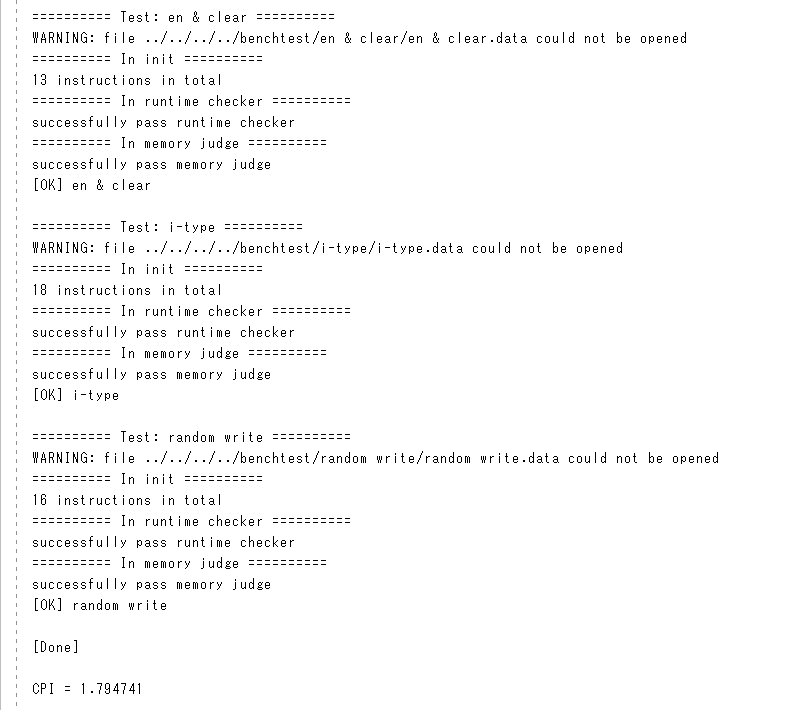

# Advanced Branch Predictor

动态分支预测器，实现了一个 2 位 Tournament Predictor，包含一个 Global Predictor、一个 Local Predictor 和一个 Static Predictor，使用 SystemVerilog 编写。[^1] [^2]

## 1. 参数

本分支预测器在实现中默认使用 Tournament Predictor，当 miss 时优先选择 Global Predictor。当 Global Predictor / Local Predictor miss 时使用 Static Predictor 作为 fallback，Static Predictor 默认采用 BTFNT（Backward-Taken, Forward Not-Taken）跳转策略。

在 [bpb.svh](./src/branch-predictor/bpb.svh) 中可调节以下参数：

- `BPB_E`：Local Predictor 的 BHT（Branch History Tracker）地址的位数 $e$，对应其大小即为 $2^e$ 条记录，默认 $e = 10$
- `BPB_T`：地址中用作 BHT 和 PHT（Pattern History Table）索引的位数 $t$（忽略最低 2 位的低 $t$ 位），默认 $t = 10$；本实现使用了直接映射，因此 $t = e$，否则需要使用其他映射方式，可以是类似于 Cache 的组相联映射，也可以通过某种 hash 函数来映射
- `MODE`：当前使用的预测模式 $\text{mode}$，可以修改为以下值，默认为 `USE_TWO_LEVEL`：
  - `USE_STATIC`：使用 Static Predictor，$\text{mode} = 0$
  - `USE_GLOBAL`：使用 Global Predictor，$\text{mode} = 1$
  - `USE_LOCAL`：使用 Local Predictor，$\text{mode} = 2$
  - `USE_TWO_LEVEL`：使用 Tournament Predictor，$\text{mode} = 3$
- `PHT_FALLBACK_MODE`：当 Tournament Predictor miss 时优先选择的预测模式，可以修改为 `USE_GLOBAL` 或 `USE_LOCAL`，默认为 `USE_GLOBAL`

在 [static_predictor.svh](./src/branch-predictor/static_predictor.svh) 中可调节以下参数：

- `FALLBACK_MODE`：Static Predictor 采用的跳转策略 $\text{fallback_mode}$，可以修改为以下值，默认为 `BTFNT`：
  - `NOT_TAKEN`：总是不跳转，$\text{fallback_mode} = 0$
  - `TAKEN`：总是跳转，$\text{fallback_mode} = 1$
  - `BTFNT`：向后分支（往较低地址，如循环）跳转、向前分支（往较高地址）不跳转，$\text{fallback_mode} = 2$

## 2. 结构

TODO

## 3. 一些改动

本分支预测器的实现基于之前实现的 Pipeline MIPS CPU with Cache，这里注明所作的一些改动。

TODO

## 4. 样例测试

### 4.1 测试结果

### 4.2 测试环境

- OS: Windows 10 Version 2004 (OS Build 19041.264)
- Using Vivado v2019.1 (64-bit)

### 4.3 测试分析

TODO

## 5. 贡献者

- [**Hakula Chen**](https://github.com/hakula139)<[i@hakula.xyz](mailto:i@hakula.xyz)> - Fudan University

## 6. 许可协议

This project is licensed under the GNU General Public License v3.0 - see the [LICENSE](../LICENSE) file for details.

## 7. 参考资料

[^1]: David A. Patterson, John L. Hennessy: *Computer Architecture: A Quantitative Approach Sixth Edition*  
[^2]: [18-740/640 Computer Architecture Lecture 5: Advanced Branch Prediction - CMU](https://course.ece.cmu.edu/~ece740/f15/lib/exe/fetch.php?media=18-740-fall15-lecture05-branch-prediction-afterlecture.pdf)
