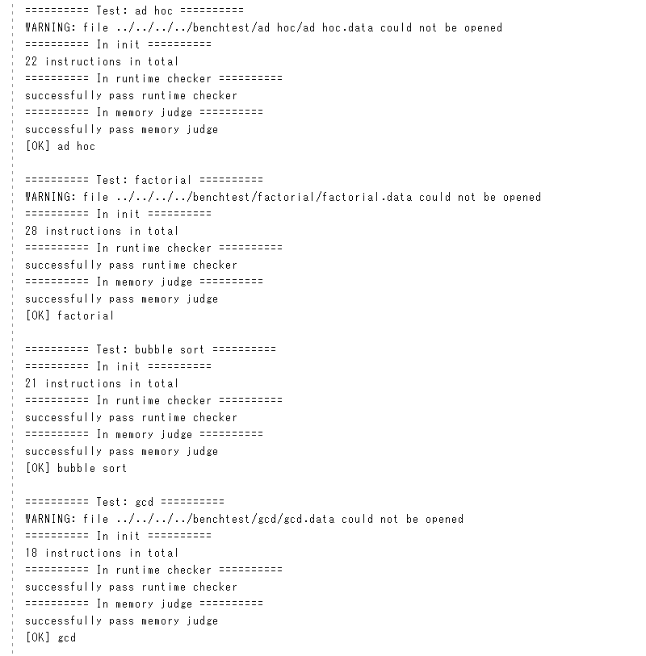

# Advanced Branch Predictor

动态分支预测器，实现了一个 2 位 Tournament Predictor，包含一个 Global Predictor、一个 Local Predictor 和一个 Static Predictor，使用 SystemVerilog 编写。[^1] [^2]

## 1. 参数

本分支预测器在实现中默认使用 Tournament Predictor，当 miss 时优先选择 Global Predictor。当 Global Predictor / Local Predictor miss 时使用 Static Predictor 作为 fallback，Static Predictor 默认采用 BTFNT（Backward-Taken, Forward Not-Taken）跳转策略。

在 [bpb.svh](./src/branch-predictor/bpb.svh) 中可调节以下参数：

- `BPB_E`：BHT（Branch History Table）地址的位数 $e$，对应 BHT 的大小即为 $2^e$ 条记录，默认 $e = 10$
- `BPB_T`：地址中用作 BHT 和 PHT（Pattern History Table）索引的位数 $t$（忽略最低 2 位的低 $t$ 位），默认 $t = 10$；本实现使用了直接映射，因此 $t = e$，否则需要使用其他映射方式，可以是类似于 Cache 的组相联映射，也可以通过某种 hash 函数来映射
- `MODE`：当前使用的预测模式 $\text{mode}$，可以修改为以下值，默认为 `USE_BOTH`：
  - `USE_STATIC`：使用 Static Predictor，$\text{mode} = 0$
  - `USE_GLOBAL`：使用 Global Predictor，$\text{mode} = 1$
  - `USE_LOCAL`：使用 Local Predictor，$\text{mode} = 2$
  - `USE_BOTH`：使用 Tournament Predictor，$\text{mode} = 3$
- `PHT_FALLBACK_MODE`：当 Tournament Predictor miss 时优先选择的预测模式，可以修改为 `USE_GLOBAL` 或 `USE_LOCAL`，默认为 `USE_GLOBAL`

在 [static_predictor.svh](./src/branch-predictor/static_predictor.svh) 中可调节以下参数：

- `FALLBACK_MODE`：Static Predictor 采用的跳转策略 $\text{fallback_mode}$，可以修改为以下值，默认为 `BTFNT`：
  - `NOT_TAKEN`：总是不跳转，$\text{fallback_mode} = 0$
  - `TAKEN`：总是跳转，$\text{fallback_mode} = 1$
  - `BTFNT`：向后分支（往较低地址，如循环）跳转、向前分支（往较高地址）不跳转，$\text{fallback_mode} = 2$

## 2. 结构

### 2.1 GHT (Global History Table)

GHT 是一个全局分支跳转记录，所有分支的跳转记录共享一个位移寄存器。Global Predictor 利用 GHT 提供的最近一次分支跳转记录 `ght_state` 来索引预测结果。

Global Predictor 的优势在于能够发现不同跳转指令间的相关性，并根据这种相关性作预测；缺点在于如果跳转指令实际并不相关，则容易被这些不相关的跳转情况所稀释（dilute）。[^3]

代码见[这里](./src/branch-predictor/ght.sv)。

### 2.2 BHT (Branch History Table)

BHT 是一个局部分支跳转记录，每个条件跳转指令的跳转记录都分别保存在按地址直接映射的专用位移寄存器内。Local Predictor 利用 BHT 提供的指定分支最近一次跳转记录 `bht_state` 来索引预测结果。

由于映射时使用了地址的低 $t$ 位 `index` 作为索引，存在重名冲突（alias）的可能，但并不需要做额外处理。因为毕竟只是「预测」，小概率发生的重名冲突所导致的预测失败并不会有很大影响。

Local Predictor 的优势在于能够发现同一跳转指令在一个时间段内的相关性，并根据这种相关性作预测；缺点在于无法发现不同跳转指令间的相关性。[^2]

代码见[这里](./src/branch-predictor/bht.sv)。

### 2.3 PHT (Pattern History Table)

Global Predictor、Local Predictor 和 Selector 都各是一个 PHT。其中 Global Predictor 使用 `index ^ ght_state` 索引，Local Predictor 使用 `index ^ bht_state` 索引，Selector 使用 `index` 索引。使用 XOR 来 hash 是为了在 PHT 的大小较小时，通过将索引地址随机化，降低重名冲突发生的概率，同时尽可能减少因此增加的延迟 [^2]。

Selector 根据上次预测的情况决定本次选用 Global Predictor 还是 Local Predictor。作为 PHT，与 Global Predictor 和 Local Predictor 一样，需要两次错误预测才会使得 Selector 切换预测模式，原理见 2.4 节。

Tournament Predictor 的优势在于能够根据不同分支的不同情况，选择最适合它这种特征的预测模式。因此在多数情况下，Tournament Predictor 会有相对较好的预测表现。

代码见[这里](./src/branch-predictor/pht.sv)。

### 2.4 Saturating Counter

对于每一个保存的记录，其形式是一个 2 位的饱和计数器，即一个有 4 种状态的状态机。

- `00`：Strongly not taken
- `01`：Weakly not taken
- `10`：Weakly taken
- `11`：Strongly taken

也就是说，通常需要连续两次实际跳转 / 不跳转，一种状态才会翻转到另一种状态，从而改变预测结果。这种机制增加了预测器的稳定性，不会因为一点波动就立即改变预测结果。

代码见[这里](./src/branch-predictor/state_switch.sv)。

### 2.5 Static Predictor

在程序刚开始运行时，GHT、BHT、PHT 都还是空的，这时候需要 fallback 到 Static Predictor。默认采用 BTFNT 策略，相较于其他静态预测模式，能够比较好地同时处理循环和一般跳转情况。

代码见[这里](./src/branch-predictor/static_predictor.sv)。

### 2.6 BPB (Branch Prediction Buffer)

BPB 也就是这个动态分支预测器的主体，负责与 CPU 的 Fetch 和 Decode 阶段交互。

实现中，BPB 先获得 Fetch 阶段的指令及其地址，通过 [Parser](./src/branch-predictor/parser.sv) 进行解析，得到一些在 Fetch 阶段就能知道的信息（如指令类型、跳转目标地址等）。目前能够很好地处理 j, jal, beq, bne 指令，但无法处理 jr 指令，因为需要寄存器的数据。为方便起见，还是把 jr 指令留给 Decode 阶段，否则需要处理新增的数据冲突和控制冲突。还有一个思路是先预读寄存器内的数据（可能有错误），等到 Decode 阶段发现寄存器内的数据有误时直接 flush 流水线，这样可以不用处理冲突，同时很多情况下可以减少 jr 指令的 CPI。由于时间问题，这里并没有尝试实现。

通过 Fetch 阶段得到的信息，利用 Tournament Predictor 进行预测，并将预测跳转的目的地址返还给 Fetch 阶段。随后在 Decode 阶段检查预测结果是否正确，如果不正确，则将 `miss` 信号置 `1`，并传给 CPU 和各 PHT。CPU 接收到 `miss` 信号后，Fetch 阶段重新计算正确的地址（此时正确的 PC 地址在 Decode 阶段，需要回传给 Fetch 阶段），Hazard Unit 发出控制信号 flush 流水线寄存器 decode_reg 和 execute_reg；PHT 接收到 `miss` 信号后，根据实际的 taken 情况进行更新，其中 Selector 则是切换到另一个预测模式（两次错误预测后）。

代码见[这里](./src/branch-predictor/bpb.sv)。

## 3. 一些改动

本分支预测器的实现基于之前实现的 Pipeline MIPS CPU with Cache，这里注明所作的一些改动。

TODO

## 4. 样例测试

### 4.1 测试结果

### 4.2 测试环境

- OS: Windows 10 Version 2004 (OS Build 19041.264)
- Using Vivado v2019.1 (64-bit)

### 4.3 测试分析

TODO

## 5. 贡献者

- [**Hakula Chen**](https://github.com/hakula139)<[i@hakula.xyz](mailto:i@hakula.xyz)> - Fudan University

## 6. 许可协议

This project is licensed under the GNU General Public License v3.0 - see the [LICENSE](../LICENSE) file for details.

## 7. 参考资料

[^1]: David A. Patterson, John L. Hennessy: *Computer Architecture: A Quantitative Approach Sixth Edition*  
[^2]: [18-740/640 Computer Architecture Lecture 5: Advanced Branch Prediction - CMU](https://course.ece.cmu.edu/~ece740/f15/lib/exe/fetch.php?media=18-740-fall15-lecture05-branch-prediction-afterlecture.pdf)  
[^3]: [Branch predictor - Wikipedia](https://en.wikipedia.org/wiki/Branch_predictor)
