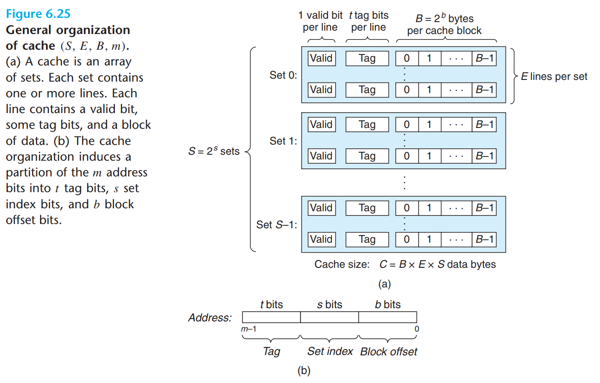

# Cache

32 位 4 路组相联（参数可调节）高速缓存，使用 SystemVerilog 编写。[^1] [^2]

## 1. 参数

本图引自 *Computer Systems: A Programmer's Perspective Third Edition* [^2]。

本缓存在实现中默认使用 4 路组相联映射：总共 4 个组（set），每组包含 4 个行（line），每行保存 4 个字（word = 4 Bytes）。默认采用 LRU（Least Recently Used）替换策略，写内存时使用写回法（Write Back）。

在 [cache.svh](./src/cache/cache.svh) 中可调节以下参数：

- `CACHE_T`：地址中 tag 的位数 $t$，默认 $t=26$
- `CACHE_S`：地址中 set index 的位数 $s$，对应组数即为 $2^s$，默认 $s=2$
- `CACHE_B`：地址中 block offset 的位数 $b$，对应行的大小即为 $2^{b-2}$ 个字（$2^b$ Bytes），默认 $b=4$
- `CACHE_E`：每组的行数 $e$，默认 $e=4$

要求 $t+s+b=32$，即地址位数 $m$。其中通过调节参数 `CACHE_E`，即可相应实现 $e$ 路组相联映射。

在 [replace_controller.svh](./src/cache/replace_controller.svh) 中可调节以下参数：

- `REPLACE_MODE`：当前缓存替换策略 $mode$，目前实现了以下策略：
  - LRU：Least Recently Used，$mode=0$
  - RR：Random Replacement，$mode=1$
  - LFU：Least Frequently Used, $mode=2$

## 2. 结构

## 3. 有限状态机（FSM）

TODO

## 4. 样例测试

### 4.1 测试结果

### 4.2 测试环境

- OS: Windows 10 Version 2004 (OS Build 19041.264)
- Using Vivado v2019.1 (64-bit)

### 4.3 测试分析

TODO

## 5. 贡献者

- [**Hakula Chen**](https://github.com/hakula139)<[i@hakula.xyz](mailto:i@hakula.xyz)> - Fudan University

## 6. 许可协议

This project is licensed under the GNU General Public License v3.0 - see the [LICENSE](../LICENSE) file for details.

## 7. 参考资料

[^1]: David A. Patterson, John L. Hennessy: *Computer Organization and Design Fifth Edition*  
[^2]: Randal E. Bryant, David R. O'Hallaron: *Computer Systems: A Programmer's Perspective Third Edition*
