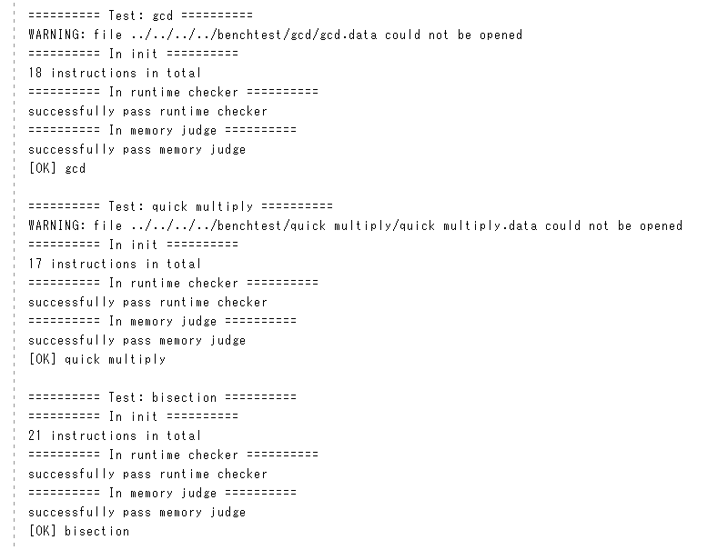

# Pipeline MIPS CPU

32 位流水线 MIPS 指令集 CPU，使用 SystemVerilog 编写。[^1]

## 1. MIPS 指令集

同单周期，详见[单周期实验报告](../Single-Cycle/README.md)。

## 2. 部件构成及分析

### 2.0 总览

如图所示为流水线 MIPS CPU 的整体概览，与单周期 MIPS CPU 是一样的，区别在于 CPU 核心 mips 的实现。以下将仅介绍与单周期不同的部分，其余请参见单周期实验报告。

### 2.1 mips

本流水线 CPU 的实现中，将 datapath 按照流水线的 5 个阶段划分为了 5 个模块（Fetch, Decode, Execute, Memory, Writeback），并增加了一个用于处理冲突的冲突单元（Hazard Unit）。其中各模块的作用如下 [^1]：

- Fetch：取指令阶段，从指令存储器中读取指令
- Decode：译码阶段，从寄存器文件中读取源操作数，并对指令译码以产生控制信号
- Execute：执行阶段，使用 ALU 执行计算
- Memory：存储器阶段，读写数据存储器
- Writeback：写回阶段，按需将结果写回到寄存器文件
- Hazard Unit：冲突单元，用于发现及处理数据冲突和控制冲突

方便起见，将 Fetch 阶段和 Decode 阶段之间的流水线寄存器命名为 decode_reg，并置于 Fetch 模块中，其余流水线寄存器同理。

具体模块功能分析将在下文阐述。这里 mips 的作用就是将这些模块连接起来，其中相同名称的端口即连通。除此以外特殊的几条连线如下所示：

- mips 读端口 reset, instr, readdata 分别与 rst, instr_f, read_data_m 连通
- mips 写端口 aluout, memwrite 分别与 alu_out_m, mem_write_m 连通

了解了以上连接规则后，展示 mips 的完整总览图就不那么必要。比起大而繁乱的连线总览图，直接看代码甚至都更为直观。

代码见[这里](./src/mips.sv)。

## 3. 样例测试

### 3.1 测试结果

### 3.2 测试环境

- OS: Windows 10 Version 2004 (OS Build 19041.172)
- Using Vivado v2019.1 (64-bit)

## 4. 贡献者

- [**Hakula Chen**](https://github.com/hakula139)<[i@hakula.xyz](mailto:i@hakula.xyz)> - Fudan University

## 5. 许可协议

This project is licensed under the GNU General Public License v3.0 - see the [LICENSE](../LICENSE) file for details.

## 6. 参考资料

[^1]: David Money Harris, Sarah L. Harris: *Digital Design and Computer Architecture Second Edition*
