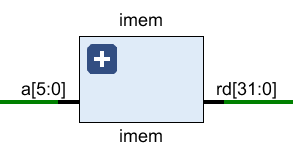
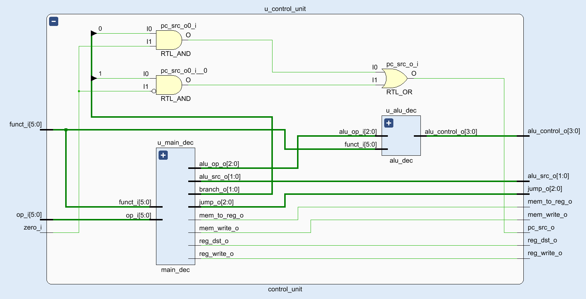
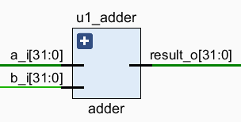
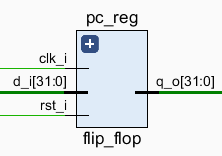
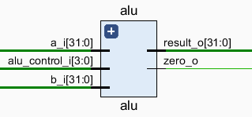

# Single-Cycle MIPS CPU

32 位单周期 MIPS 指令集 CPU，使用 SystemVerilog 编写。

## 1. MIPS 指令集

### 1.1 实现指令集一览

```assembly
add     $rd, $rs, $rt                   # [rd] = [rs] + [rt]
sub     $rd, $rs, $rt                   # [rd] = [rs] - [rt]
and     $rd, $rs, $rt                   # [rd] = [rs] & [rt]
or      $rd, $rs, $rt                   # [rd] = [rs] | [rt]
slt     $rd, $rs, $rt                   # [rd] = [rs] < [rt] ? 1 : 0
sll     $rd, $rt, shamt                 # [rd] = [rt] << shamt
srl     $rd, $rt, shamt                 # [rd] = [rt] >> shamt
sra     $rd, $rt, shamt                 # [rd] = [rt] >>> shamt
addi    $rt, $rs, imm                   # [rt] = [rs] + SignImm
andi    $rt, $rs, imm                   # [rt] = [rs] & ZeroImm
ori     $rt, $rs, imm                   # [rt] = [rs] | ZeroImm
slti    $rt, $rs, imm                   # [rt] = [rs] < SignImm ? 1 : 0
lw      $rt, imm($rs)                   # [rt] = [Address]
sw      $rt, imm($rs)                   # [Address] = [rt]
j       label                           # PC = JTA
jal     label                           # [ra] = PC + 4, PC = JTA
jr      $rs                             # PC = [rs]
beq     $rs, $rt, label                 # if ([rs] == [rt]) PC = BTA
bne     $rs, $rt, label                 # if ([rs] != [rt]) PC = BTA
nop                                     # No operation
```

其中使用的符号释义如下：

- `[reg]`：寄存器 `$reg` 中的内容
- `imm`：I 类型指令的 16 位立即数字段
- `addr`：J 类型指令的 26 位地址字段
- `label`：指定指令地址的文本
- `SignImm`：32 位符号扩展的立即数（`= {{16{imm[15]}}, imm}`）
- `ZeroImm`：32 位 0 扩展的立即数（`= {16'b0, imm}`）
- `Address`：`[rs] + SignImm`
- `[Address]`：存储器单元 `Address` 地址中的内容
- `JTA`：跳转目标地址（`= (PC + 4)[31:28], addr, 2'b0`）
- `BTA`：分支目标地址（`= PC + 4 + (SignImm << 2)`）

### 1.2 对应机器码格式

[[Ref. 2]](#参考资料)

```text
add:    0000 00ss ssst tttt dddd d--- --10 0000
sub:    0000 00ss ssst tttt dddd d--- --10 0010
and:    0000 00ss ssst tttt dddd d--- --10 0100
or:     0000 00ss ssst tttt dddd d--- --10 0101
slt:    0000 00ss ssst tttt dddd d--- --10 1010
sll:    0000 00ss ssst tttt dddd dhhh hh00 0000
srl:    0000 00-- ---t tttt dddd dhhh hh00 0010
sra:    0000 00-- ---t tttt dddd dhhh hh00 0011
addi:   0010 00ss ssst tttt iiii iiii iiii iiii
andi:   0011 00ss ssst tttt iiii iiii iiii iiii
ori:    0011 01ss ssst tttt iiii iiii iiii iiii
slti:   0010 10ss ssst tttt iiii iiii iiii iiii
lw:     1000 11ss ssst tttt iiii iiii iiii iiii
sw:     1010 11ss ssst tttt iiii iiii iiii iiii
j:      0000 10aa aaaa aaaa aaaa aaaa aaaa aaaa
jal:    0000 11aa aaaa aaaa aaaa aaaa aaaa aaaa
jr:     0000 00ss sss- ---- ---- ---- --00 1000
beq:    0001 00ss ssst tttt iiii iiii iiii iiii
bne:    0001 01ss ssst tttt iiii iiii iiii iiii
nop:    0000 0000 0000 0000 0000 0000 0000 0000
```

## 2. 部件构成及分析

### 2.0 总览


如图所示为单周期 MIPS CPU 的整体概览。直观起见，先仅展示这几个模块。其中 mips 为 CPU 核心，imem 为指令储存器（Instruction Memory），dmem 为数据储存器（Data Memory）。

### 2.1 imem



指令储存器内置了 64 个 32 位寄存器，用于储存指令。

使用时从 A 读入指令地址（`0x0` ~ `0x3F`），从 RD 输出这个地址中的 32 位指令。

代码见[这里](./src/imem.sv)。

### 2.2 dmem


数据储存器内置了 64 个 32 位寄存器，用于读写大量数据。其特点是容量大、读写速度慢（相较于寄存器）。

当写使能 WE 为 `1` 时，在时钟上升沿将数据 WD 写入地址 A；当写使能 WE 为 `0` 时，将地址 A 中的数据读入到 RD。

代码见[这里](./src/dmem.sv)。

### 2.3 mips


CPU 核心可分为两个部分：control_unit 和 datapath，分别表示控制单元和数据通路。

代码见[这里](./src/mips.sv)。

### 2.4 control_unit



控制单元负责解析输入的指令，决定各个控制信号。

实现中，先通过主译码器 main_dec 解码，对其中类型为 R-type 的指令再通过 ALU 译码器 alu_dec 解码。

代码见[这里](./src/control_unit.sv)。实现中将控制信号集中赋值，省去了书写大量赋值语句的麻烦。

```verilog
logic [13:0] bundle;
assign {reg_write_o, reg_dst_o, alu_src_o, alu_op_o,
        jump_o, branch_o, mem_write_o, mem_to_reg_o} = bundle;

always_comb begin
  unique case (op_i)
    6'b001000: bundle <= 14'b10_01000_000_00_00;   // ADDI
    // ...
  endcase
end
```

#### 2.4.1 main_dec

主译码器。完整真值表如下 [[Ref. 3]](#参考资料)：

| 指令   | opcode | funct   | rw | rd | alus | aluop | j   | br | mw | mr |
|:------:|:------:|:-------:|:--:|:--:|:----:|:-----:|:---:|:--:|:--:|:--:|
| add    | 000000 | 100000  | 1  | 1  | 00   | 100   | 000 | 00 | 0  | 0  |
| sub    | 000000 | 100010  | 1  | 1  | 00   | 100   | 000 | 00 | 0  | 0  |
| and    | 000000 | 100100  | 1  | 1  | 00   | 100   | 000 | 00 | 0  | 0  |
| or     | 000000 | 100101  | 1  | 1  | 00   | 100   | 000 | 00 | 0  | 0  |
| slt    | 000000 | 101010  | 1  | 1  | 00   | 100   | 000 | 00 | 0  | 0  |
| sll    | 000000 | 000000  | 1  | 1  | 00   | 100   | 000 | 00 | 0  | 0  |
| srl    | 000000 | 000010  | 1  | 1  | 00   | 100   | 000 | 00 | 0  | 0  |
| sra    | 000000 | 000011  | 1  | 1  | 00   | 100   | 000 | 00 | 0  | 0  |
| addi   | 000000 | /       | 1  | 0  | 01   | 000   | 000 | 00 | 0  | 0  |
| andi   | 000000 | /       | 1  | 0  | 01   | 010   | 000 | 00 | 0  | 0  |
| ori    | 000000 | /       | 1  | 0  | 01   | 110   | 000 | 00 | 0  | 0  |
| slti   | 000000 | /       | 1  | 0  | 01   | 111   | 000 | 00 | 0  | 0  |
| lw     | 000000 | /       | 1  | 0  | 01   | 000   | 000 | 00 | 0  | 1  |
| sw     | 000000 | /       | 0  | /  | 01   | 000   | 000 | 00 | 1  | /  |
| j      | 000000 | /       | 0  | /  | /    | /     | 001 | /  | 0  | /  |
| jal    | 000000 | /       | 1  | 0  | /    | /     | 101 | /  | 0  | /  |
| jr     | 000000 | 001000  | 0  | /  | /    | /     | 010 | /  | 0  | /  |
| beq    | 000000 | /       | 0  | /  | 00   | 001   | 000 | 01 | 0  | /  |
| bne    | 000000 | /       | 0  | /  | 00   | 001   | 000 | 10 | 0  | /  |

（nop 实际上只是 sll 的特例，这里就省略了。）

表头使用了一些缩写，其中：

- rw 即 reg_write，当需要写寄存器时为 `1`
- rd 即 reg_dst，当指令类型为 R-type 时为 `1`，I-type 时为 `0`
- alus 即 alu_src，`alu_src[1]` 决定 src_a 的取值，`alu_src[0]` 决定 src_b 的取值
  - `alu_src[1]` 为 `0` 时，src_a 为寄存器文件 RD1 读出值
  - `alu_src[1]` 为 `1` 时，src_a 为 `instr[10:6]`（需 32 位 0 扩展），用于移位操作 sll 等
  - `alu_src[0]` 为 `0` 时，src_b 为寄存器文件 RD2 读出值
  - `alu_src[0]` 为 `1` 时，src_b 为 `instr_i[15:0]`（需 32 位符号扩展），用于需要立即数计算的操作 addi 等
- aluop 即 alu_op，与指令的映射关系已在表中给出；当指令为 beq, bne 时需要做减法，故值为 `001`
- j 即 jump，当指令为 j, jal, jr 时分别为 `001`, `101`, `010`，只是我个人的实现方式，其效果在于届时 datapath 的代码写起来会相对方便
- br 即 branch，当指令为 beq, bne 时分别为 `01`, `10`
- mw 即 mem_write，当需要写内存 dmem 时为 `1`，用于指令 sw
- mr 即 mem_ro_reg，当需要将内存 dmem 读出的值写入寄存器时为 `1`，用于指令 lw

#### 2.4.2 alu_dec

ALU 译码器。完整真值表如下 [[Ref. 3]](#参考资料)：

| 指令         | alu_op | funct   | alu_control |
|:------------:|:------:|:-------:|:-----------:|
| add          | 100    | 100000  | 0010        |
| sub          | 100    | 100010  | 0110        |
| and          | 100    | 100100  | 0000        |
| or           | 100    | 100101  | 0001        |
| slt          | 100    | 101010  | 0111        |
| sll          | 100    | 000000  | 0011        |
| srl          | 100    | 000010  | 1000        |
| sra          | 100    | 000011  | 1001        |
| addi, lw, sw | 000    | /       | 0010        |
| beq, bne     | 001    | /       | 0110        |
| andi         | 010    | /       | 0000        |
| ori          | 110    | /       | 0001        |
| slti         | 111    | /       | 0111        |

### 2.5 datapath


图比较大，如果看不清字可以直接查看[原图](./assets/datapath.png)，不过接下来我会拆解开来讲其中的每个部件。

数据通路的作用就是将所有这些部件连接起来，传递各种信号。

代码见[这里](./src/datapath.sv)。

### 2.6 sign_ext


符号扩展模块的作用是将 16 位的立即数符号扩展至 32 位。

使用时从 A 读入待扩展的数据，从 RESULT 输出扩展后的数据。

代码见[这里](./src/utils.sv)。

### 2.7 adder



32 位加法器，用于计算 PC 值及跳转地址。

使用时读入 A 和 B，从 RESULT 输出 A 和 B 相加后的值。

代码见[这里](./src/utils.sv)。

### 2.8 mux2 & mux4


多路复用器，用于数据多选一，操作数位数可改变。

使用时读入多路 DATA，从 RESULT 输出 SELECT 选择的那一路的数据。以 mux4 为例，SELECT 为 `00`, `01`, `10`, `11` 时分别输出 DATA0, DATA1, DATA2, DATA3 的值。

图中 mux4 只输入了 3 个 DATA，是因为这里只需要用到 3 个。教材的电路设计中并没有用到 mux4，我引入 mux4 的目的是为了简化 pc_next 和 write_reg 的选择电路。

对于 pc_next（新的 PC 值），其值的选择逻辑如下（部分符号释义见第 1 节，下同）：

- 一般情况下，`pc_next` = `PC + 4`；由 `pc_src` 信号控制 `pc_branch_next_mux2` 选择，此时 `pc_src` 为 `0`
- 对于指令 beq, bne，`pc_next` = `BTA`；由 `pc_src` 信号控制 `pc_branch_next_mux2` 选择，此时 `pc_src` 为 `1`，`jump[1:0]` 为 `00`
- 对于指令 j, jal，`pc_next` = `JTA`；由 `jump` 信号控制 `pc_next_mux4` 选择，此时 `pc_src` 为 `1`，`jump[1:0]` 为 `01`
- 对于指令 jr，`pc_next` = `[rs]`；由 `jump` 信号控制 `pc_next_mux4` 选择，此时 `pc_src` 为 `1`，`jump[1:0]` 为 `10`

对于 write_reg（写入的目标寄存器），由 `reg_dst` 和 `jump` 信号控制 `write_reg_mux4` 选择，其值的选择逻辑如下：

- 对于 I-type 指令，`write_reg` = `[rt]`；此时 `reg_dst` 为 `0`，`jump[2]` 为 `0`
- 对于 R-type 指令，`write_reg` = `[rd]`；此时 `reg_dst` 为 `1`，`jump[2]` 为 `0`
- 对于指令 jal，`write_reg` = `$ra`；此时 `jump[2]` 为 `1`

对于 write_reg_data（写入目标寄存器的数据），其值的选择逻辑如下：

- 一般情况下，`write_reg_data` = `alu_result`，其中 `alu_result` 为 ALU 运算结果；由 `mem_to_reg` 信号控制 `result_mux2` 选择，此时 `mem_to_reg` 为 `0`，`jump[2]` 为 `0`
- 对于指令 lw，`write_reg_data` = `[Address]`；由 `mem_to_reg` 信号控制 `result_mux2` 选择，此时 `mem_to_reg` 为 `1`，`jump[2]` 为 `0`
- 对于指令 jal，`write_reg_data` = `PC + 4`；由 `jump` 信号控制 `write_reg_data_mux2` 选择，此时 `jump[2]` 为 `1`

代码见[这里](./src/utils.sv)。

### 2.9 reg_file


寄存器文件内置了 32 个 32 位寄存器，用于读写临时数据。

使用时从 A1 和 A2 分别读入地址（`0x0` ~ `0x1F`）以指定寄存器，然后从 RD1 和 RD2 分别输出对应寄存器中的 32 位数据。其中 0 号寄存器的值始终为 `0`，因此在实现中直接返回 `0`。当写使能 WE3 为 `1` 时，在时钟上升沿将数据 WD3 写入地址 WA3 指定的寄存器。当重置信号 RST 为 `1` 时，清空所有寄存器中的数据。

代码见[这里](./src/reg_file.sv)。

### 2.10 flip_flop



触发器，用于储存 PC。

在时钟上升沿将新的 PC 值 D 写入。当重置信号 RST 为 `1` 时，将 PC 异步清零。

代码见[这里](./src/flip_flop.sv)。

### 2.11 alu



算术逻辑单元（ALU），用于加减、位运算等算术操作。

ALU 根据 ALU_CONTROL 信号决定对操作数 A 和 B 进行何种运算，从 RESULT 输出运算结果，从 ZERO 输出结果是否为 `0`。其中 ALU_CONTROL 由控制单元根据 alu_op 和 funct 决定。具体映射表如下：

| alu_control | result        |  指令             |
|:-----------:|:-------------:|:-----------------:|
| 0000        | a & b         | and, andi         |
| 0001        | a \| b        | or, ori           |
| 0010        | a + b         | add, addi, lw, sw |
| 0011        | b << a        | sll               |
| 0100        | a & ~b        | /                 |
| 0101        | a \| ~b       | /                 |
| 0110        | a - b         | sub, beq, bne     |
| 0111        | a < b ? 1 : 0 | slt, slti         |
| 1000        | b >> a        | srl               |
| 1001        | b >>> a       | sra               |

代码见[这里](./src/alu.sv)。

## 参考资料

1. David Money Harris, Sarah L. Harris: *Digital Design and Computer Architecture Second Edition*
2. [^](#12-对应机器码格式) [MIPS Instruction Set · MIPT-ILab/mipt-mips Wiki](https://github.com/MIPT-ILab/mipt-mips/wiki/MIPS-Instruction-Set)
3. [^](#241-main_dec) [^](#242-alu_dec) [361 Computer Architecture Lecture 9: Designing Single Cycle Control](http://users.ece.northwestern.edu/~kcoloma/ece361/lectures/Lec09-singlecontrol.pdf)

## 贡献者

- [**Hakula Chen**](https://github.com/hakula139)<[i@hakula.xyz](mailto:i@hakula.xyz)> - Fudan University

## 许可协议

This project is licensed under the GNU General Public License v3.0 - see the [LICENSE](./LICENSE) file for details.
